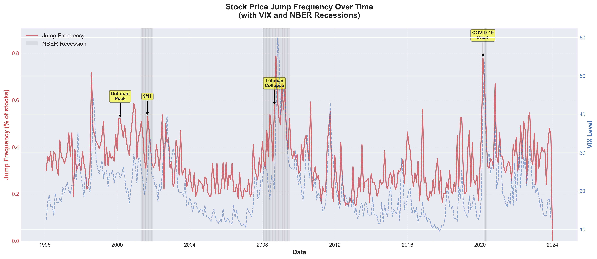
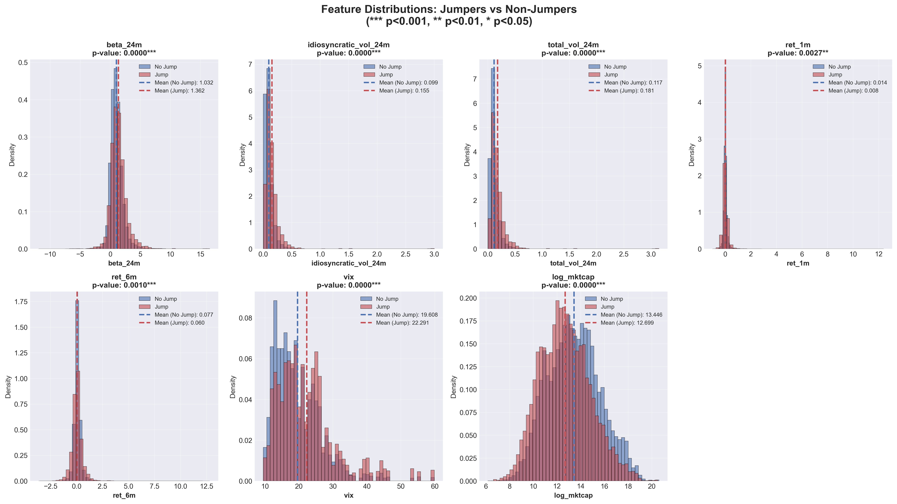
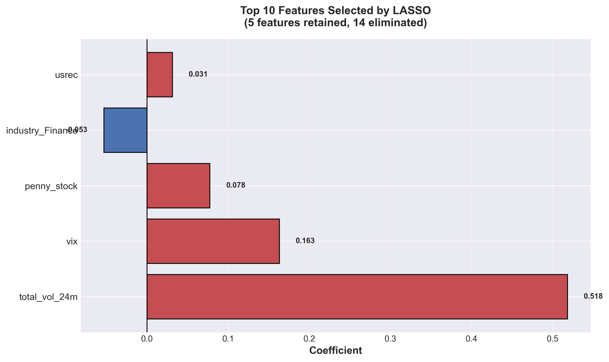
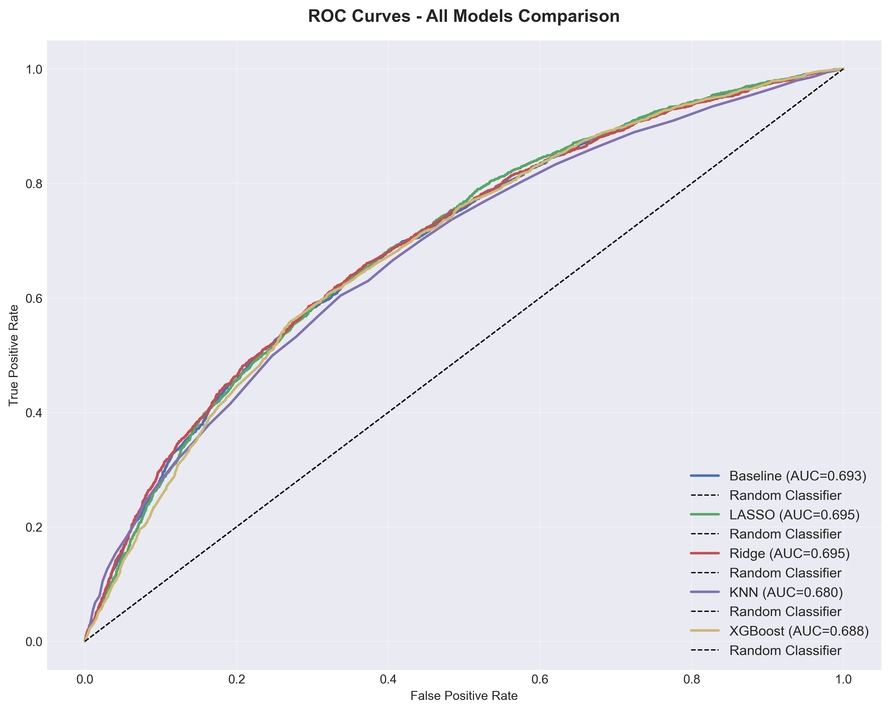
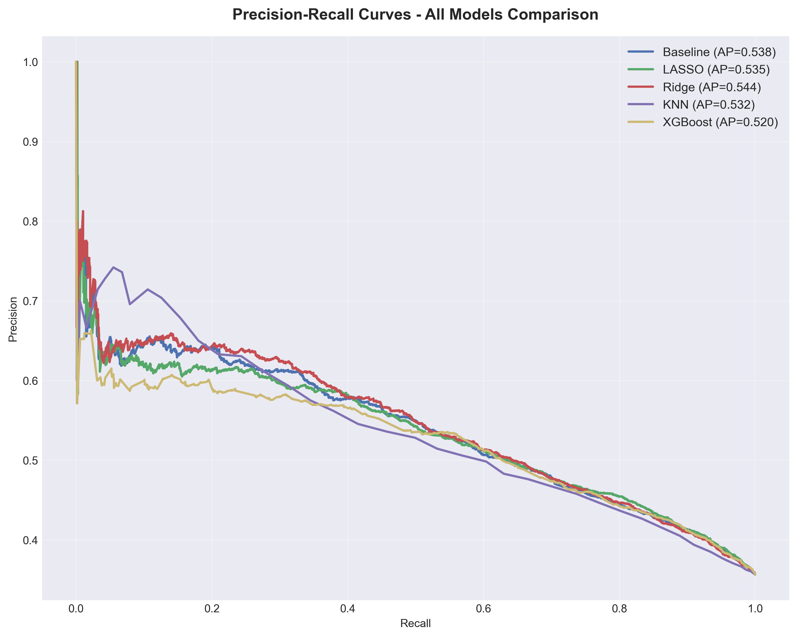
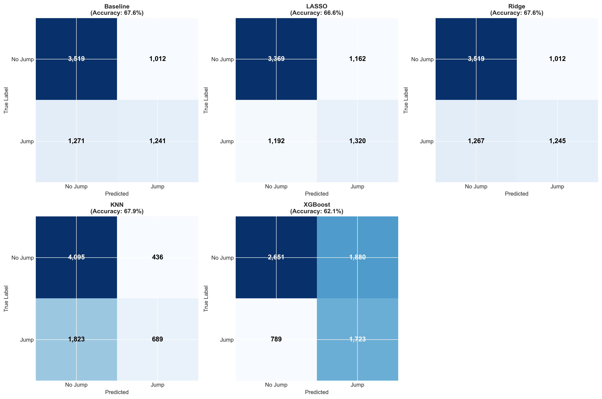

# Predicting Stock Price Jumps: A Machine Learning Approach

**Author:** Emma Nagy  
**Date:** September 2025  
**Data Source:** CRSP (1996-2023)

[](https://nbviewer.org/github/enagy827/predicting-stock-price-jumps/blob/main/Stock_Jump_Prediction.ipynb)
[](report/Portfolio_Project_5__Predicting_Stock_Price_Jumps.pdf)

---

## 📊 Project Overview

This project develops and compares five machine learning models to predict large monthly stock price movements (jumps >10%) using 28 years of historical data. Through proper temporal validation and comprehensive model comparison, the analysis demonstrates that while jumps contain substantial unpredictable components, systematic patterns based on volatility and macroeconomic stress provide actionable signals for tail risk management.

**Dataset:** 1,023 U.S. stocks, 33,432 stock-month observations (1996-2023)  
**Models Compared:** Logistic Regression, LASSO, Ridge, K-Nearest Neighbors, XGBoost  
**Performance:** AUC ≈0.70 (modest but economically meaningful predictability)

## 🔍 Key Findings

1. **Simple Models Win**: Linear models (Ridge, LASSO, Baseline) achieve AUC 0.6929-0.6950, matching or exceeding sophisticated ensemble methods (XGBoost, KNN). Jump dynamics are fundamentally linear rather than involving complex interactions.

2. **Five Features Suffice**: LASSO identifies 5 core predictors that capture 99.9% of achievable performance, eliminating 14 features (73.7%) as noise. This dramatic reduction reveals a simple core structure: volatility + macro stress.

3. **Volatility Dominates**: Total volatility ranks #1 across all models with universal agreement. Coefficient 3x larger than the second-ranked feature. High firm-specific uncertainty drives jump probability more than any other characteristic.

4. **Macro Stress Amplifies Risk**: VIX and recession indicators consistently rank in top 5. Market-wide stress amplifies individual stock vulnerability through liquidity effects, contagion, and information cascades. Jump rate during recessions (48.6%) nearly doubles expansion rate (31.9%).

5. **Prediction Ceiling at AUC 0.70**: Tight clustering of all models (0.0155 AUC spread) indicates fundamental limits to jump predictability. Information shocks are inherently unpredictable, but systematic patterns provide economically valuable signals for risk management.

---

## 📁 Repository Contents

```
predicting-stock-price-jumps/
├── Stock_Jump_Prediction.ipynb              # Complete analysis notebook (11 sections)
├── outputs/                                 # All generated visualizations (27 files)
│   ├── jump_frequency_timeseries.png
│   ├── feature_distributions_comparison.png
│   ├── correlation_heatmap.png
│   ├── logit_feature_importance.png
│   ├── logit_train_performance.png
│   ├── logit_train_confusion.png
│   ├── logit_test_performance.png
│   ├── logit_test_confusion.png
│   ├── logit_error_analysis.png
│   ├── lasso_cv_scores.png
│   ├── lasso_feature_importance.png
│   ├── lasso_test_comparison.png
│   ├── ridge_cv_scores.png
│   ├── ridge_feature_importance.png
│   ├── regularization_comparison.png
│   ├── knn_tuning.png
│   ├── knn_test_performance.png
│   ├── all_models_comparison.png
│   ├── xgboost_feature_importance.png
│   ├── xgboost_test_performance.png
│   ├── xgboost_confusion_matrix.png
│   ├── final_roc_comparison.png
│   ├── final_pr_comparison.png
│   ├── confusion_matrices_comparison.png
│   ├── feature_temporal_stability.png
│   ├── final_all_models_comparison.png
│   └── feature_stability_over_time.png
├── report/
│   └── Portfolio_Project_5__Predicting_Stock_Price_Jumps.pdf  # Technical report
├── requirements.txt                         # Python dependencies
└── README.md                                # This file
```

---

## 📈 Visualizations

### 1. Jump Clustering Over Time

*Monthly jump rate (1996-2023) with VIX overlay and recession shading. Jumps cluster during crises (dot-com crash, financial crisis, COVID-19) rather than occurring randomly. Strong correlation with VIX (r=0.645) confirms market stress amplifies jump risk.*

### 2. Feature Distributions: Jumpers vs Non-Jumpers  

*Systematic differences across volatility measures. Jumpers exhibit 57% higher idiosyncratic volatility, 54% higher total volatility, and 32% higher beta. All differences significant at p<0.001.*

### 3. LASSO Feature Selection

*LASSO selected only 5 of 19 features. Total volatility dominates (coefficient 0.518), more than 3x the second-ranked feature (VIX, 0.163). Eliminated 14 features as noise.*

### 4. Model Performance Comparison

*ROC curves for all five models. Linear models cluster tightly (AUC 0.6929-0.6950). All substantially exceed random guessing. Tight spread indicates fundamental predictability ceiling reached.*

### 5. Precision-Recall Trade-offs

*Precision-recall curves reveal how models balance true positive rate against prediction accuracy. Ridge maintains highest precision across recall levels (average precision 0.544).*

### 6. Confusion Matrices

*Error distributions reveal different strategies. XGBoost: aggressive (69% recall, 42% false positive rate). KNN: conservative (27% recall, 10% false positive rate). Linear models: balanced middle ground.*

---

## 🚀 How to Run This Analysis

### View Online (No Installation Required)

**[View the interactive notebook on nbviewer →](https://nbviewer.org/github/enagy827/predicting-stock-price-jumps/blob/main/Stock_Jump_Prediction.ipynb)**

### Run Locally

#### Prerequisites
- Python 3.8 or higher
- Jupyter Notebook or JupyterLab
- 8GB+ RAM recommended

#### Option 1: Using Git

```bash
# Clone the repository
git clone https://github.com/enagy827/predicting-stock-price-jumps.git
cd predicting-stock-price-jumps

# Install dependencies
pip install -r requirements.txt

# Launch Jupyter
jupyter notebook

# Open Stock_Jump_Prediction.ipynb and run all cells
```


## 🛠️ Methodology

### Jump Definition
A jump is defined as an absolute monthly return exceeding 10%:
```
Jump_t = 1 if |return_t| > 0.10, else 0
```
This threshold balances identifying genuinely large moves while maintaining sufficient positive class frequency (35% jump rate).

### Feature Engineering (19 features total)

**Volatility Measures** (CAPM-based):
- Total volatility (24-month rolling standard deviation)
- Systematic volatility (β × σ_market)
- Idiosyncratic volatility (√(σ²_total - σ²_systematic))
- Volatility ratio

**CAPM Metrics**:
- Beta (24-month rolling regression)

**Momentum**:
- 6-month cumulative return

**Macroeconomic Indicators**:
- VIX (CBOE Volatility Index)
- USREC (NBER recession indicator)
- Federal Funds Rate
- Unemployment rate
- Credit spread (high-yield corporate bonds over Treasuries)

**Firm Characteristics**:
- Log market capitalization
- Penny stock indicator (price <$5)
- Industry classification (9 sectors, one-hot encoded)

### Temporal Validation (Prevents Look-Ahead Bias)

**Training:** 1996-2012 (20,314 observations, 34.6% jump rate)  
**Validation:** 2013-2017 (5,954 observations, 26.4% jump rate)  
**Test:** 2018-2023 (7,164 observations, 35.7% jump rate)

Strict temporal split ensures model only sees historical data when making predictions. Test period includes COVID-19 crash, providing rigorous evaluation on unprecedented market conditions.

### Models Compared

1. **Baseline Logistic Regression**: Simple linear model with L2 penalty
2. **LASSO (L1)**: Automatic feature selection via coefficient elimination
3. **Ridge (L2)**: Coefficient shrinkage without elimination
4. **K-Nearest Neighbors**: Non-parametric, distance-based (optimal K=51)
5. **XGBoost**: Gradient boosted trees with extensive hyperparameter tuning

### Evaluation Metrics

**Primary:** AUC-ROC (Area Under Receiver Operating Characteristic curve)
- Measures discrimination across all thresholds
- Robust to class imbalance
- AUC=0.70 means 70% chance model ranks actual jumper higher than non-jumper

**Secondary:** Precision, Recall, F1-Score, Confusion Matrices, Average Precision

---

## 💻 Technologies Used

- **Python 3.8+**: Core programming language
- **Pandas**: Data manipulation and preprocessing
- **NumPy**: Numerical computations
- **Scikit-learn**: Machine learning models and evaluation
- **XGBoost**: Gradient boosted trees
- **Matplotlib/Seaborn**: Static visualizations
- **Jupyter**: Reproducible analysis environment
- **LaTeX**: Professional technical report

---

## 🎯 Key Insights

### Model Performance Rankings

| Model | Type | Features | Test AUC | Recall | Precision |
|-------|------|----------|----------|--------|-----------|
| Ridge | Linear (L2) | 19 | **0.6950** | 49.6% | 55.2% |
| LASSO | Linear (L1) | **5** | 0.6945 | 52.6% | 53.2% |
| Baseline | Linear | 19 | 0.6929 | 49.4% | 55.1% |
| XGBoost | Tree Ensemble | 19 | 0.6878 | **68.6%** | 47.8% |
| KNN | Non-parametric | 19 | 0.6795 | 27.4% | **61.2%** |

### The Five Core Predictors (LASSO Selection)

1. **Total Volatility (24m)** [0.518]: Firm-specific uncertainty dominates
2. **VIX** [0.163]: Market-wide fear amplifies individual stock risk
3. **Penny Stock Indicator** [0.078]: Structural vulnerabilities beyond volatility
4. **Finance Industry** [-0.053]: Regulatory constraints reduce jump probability
5. **Recession Indicator** [0.031]: Economic regime shifts increase repricing

**Eliminated (14 features):** Beta, momentum (all horizons), systematic/idiosyncratic volatility components, granular macro indicators, 7 industry dummies

### Economic Interpretation

**Why does volatility dominate?** High volatility signals uncertainty about earnings, management, competitive position, or regulatory environment. When information arrives (earnings surprise, competitor announcement), uncertain companies experience larger price reactions.

**Why do simple models win?** Jump prediction involves fundamentally linear relationships. When volatility doubles, jump probability increases in a log-linear fashion. Complex interactions captured by XGBoost don't improve generalization (training AUC 0.724 vs test 0.688 = overfitting).

**What's the prediction ceiling?** AUC ≈0.70 reflects fundamental limits. Jumps contain substantial unpredictable components (genuine information shocks cannot be anticipated from historical patterns). Consistent performance across diverse methodologies confirms this ceiling arises from problem structure, not modeling failures.

### Implications

**For Risk Managers:** Use LASSO's 5-feature model for dynamic hedging. Allocate tail risk budget to high-jump-probability positions. Modest AUC (0.70) still provides economically valuable signals when applied systematically.

**For Portfolio Managers:** High jump probability stocks warrant smaller position sizes. Understand recall-precision trade-off when selecting models (XGBoost for catching jumps, KNN for minimizing false alarms, LASSO for balance).

**For Researchers:** Feature engineering matters more than algorithmic sophistication. Simple models often outperform complex ones in noisy domains. Proper temporal validation essential to avoid look-ahead bias.

---

## 📄 Technical Report

For detailed methodology, statistical analysis, economic interpretation, comprehensive discussion, and complete bibliography, see the full technical report:

**[Download PDF Report →](report/Portfolio_Project_5__Predicting_Stock_Price_Jumps.pdf)**


---

## 📊 Data Source

**CRSP (Center for Research in Security Prices)**

- **Coverage**: Monthly stock returns for U.S. equities (NYSE, AMEX, NASDAQ)
- **Time Period**: January 1996 through December 2023 (28 years)
- **Sample**: 1,023 unique stocks, 33,432 stock-month observations
- **Sampling Method**: Stratified random sampling (100 stocks/year across market cap quintiles)

**Macroeconomic Data:**
- VIX: CBOE (Chicago Board Options Exchange)
- USREC: NBER (National Bureau of Economic Research)
- Federal Funds Rate: Federal Reserve
- Credit Spread: Federal Reserve Economic Data (FRED)

---

## 📚 Project Context

This project demonstrates proficiency in:
- Machine learning for financial prediction
- Temporal validation and proper train/test/validation splits
- Feature engineering from financial theory (CAPM, volatility decomposition)
- Model comparison across diverse algorithmic approaches
- Regularization methods (LASSO, Ridge)
- Hyperparameter tuning and cross-validation
- Economic interpretation of statistical results

The analysis addresses three key research questions:
1. **Predictability**: Can stock jumps be predicted, and what performance is achievable?
2. **Feature Importance**: Which characteristics drive jump predictions?
3. **Model Selection**: When does model complexity add value versus when does simplicity suffice?

---

## 🔬 Research Highlights

### Challenges Conventional Wisdom

- **"Complex models always win on tabular data"** → Simple linear regression matches XGBoost performance
- **"More features = better predictions"** → 5 features achieve 99.9% of 19-feature performance
- **"Momentum predicts crashes"** → All momentum terms eliminated by LASSO as irrelevant

### Confirms Financial Theory

- **Volatility persistence** → Historical volatility predicts future extreme moves
- **Systematic risk amplification** → VIX consistently ranks top 4 across all models
- **Economic regime effects** → Recession indicator adds information beyond continuous macro variables

### Novel Findings

- **Total volatility > decomposition** → Total volatility sufficient; systematic/idiosyncratic components redundant (r=0.99)
- **Linear relationships dominate** → No evidence of complex interactions or threshold effects
- **Finance sector protective effect** → Regulated financial firms show lower jump probability after controlling for volatility

---

## 🔗 Contact

For questions, collaboration opportunities, or to discuss this research:

- **Portfolio**: [emmanagy.net](https://www.emmanagy.net/)
- **LinkedIn**: [Emma Nagy](https://www.linkedin.com/in/emma-nagy/)

---

## 📝 Citation

If you use this analysis or methodology in your research, please cite:

```
Nagy, E. (2026). Predicting Stock Price Jumps: A Machine Learning Approach (1996-2023). 
Comparative analysis of five ML models for financial tail risk prediction.
https://github.com/enagy827/predicting-stock-price-jumps
```

---

## 📜 License

This project is available for educational and research purposes.

---

*Last updated: February 2026*
